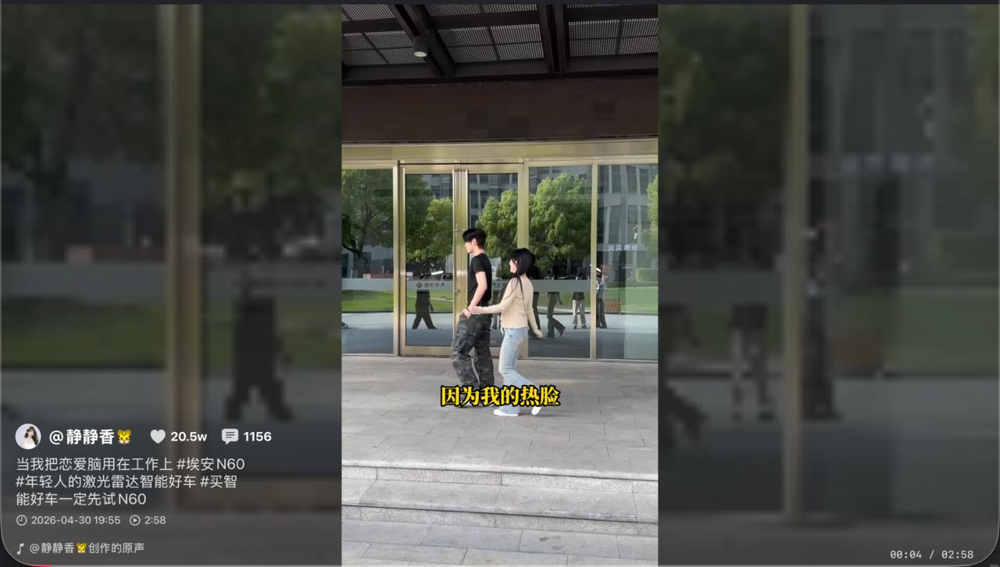
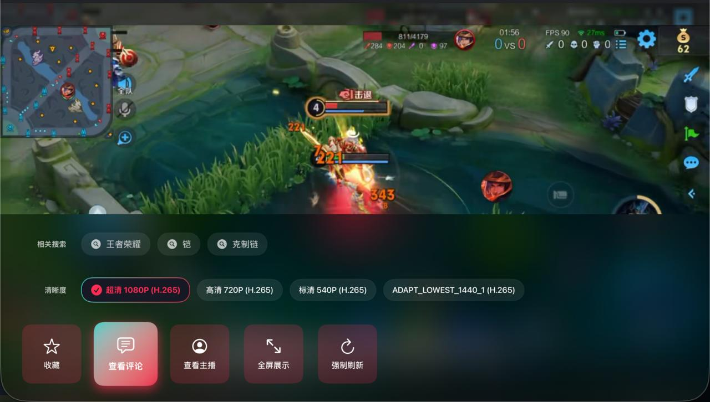
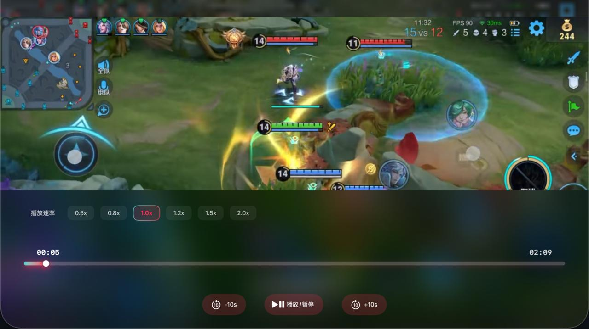
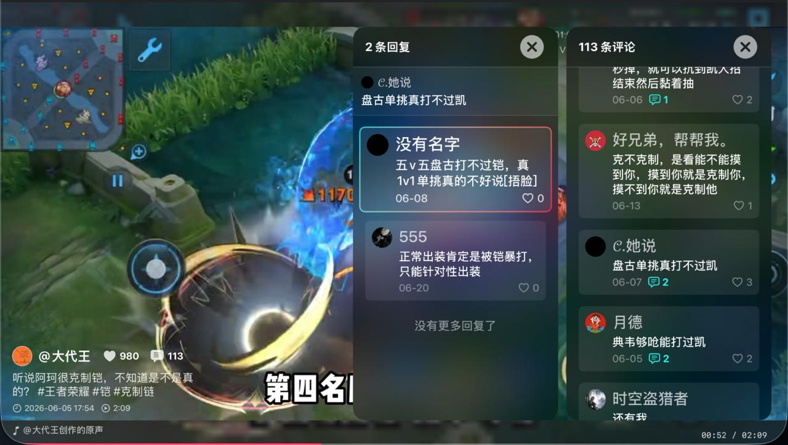
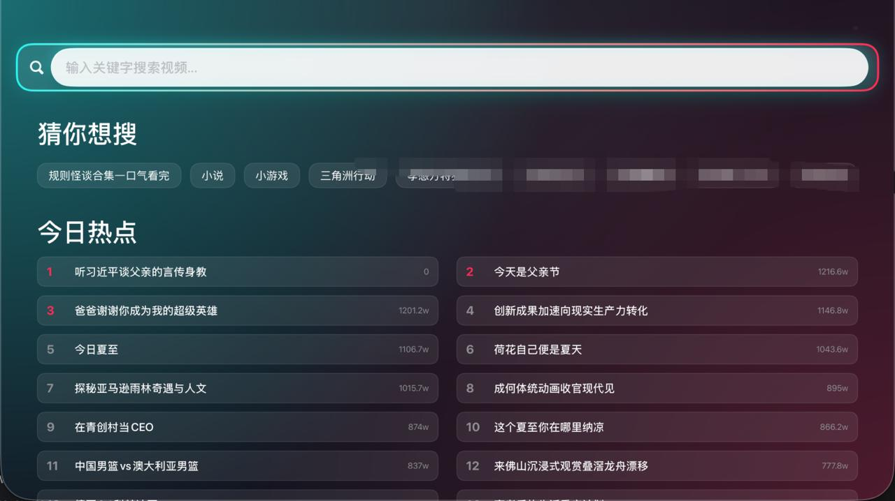
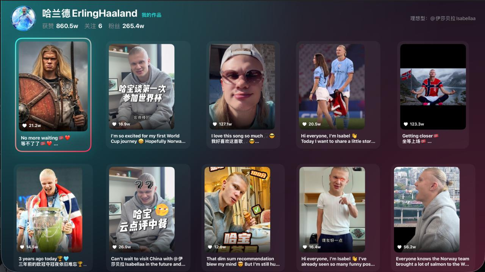
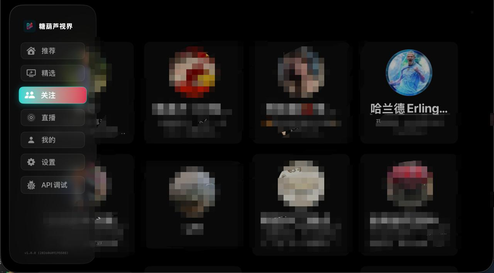
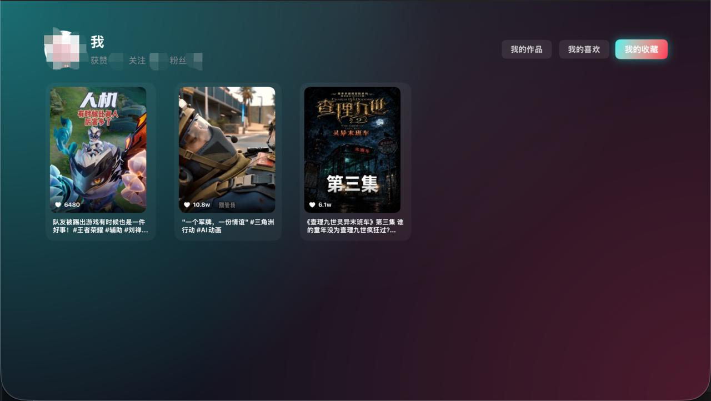
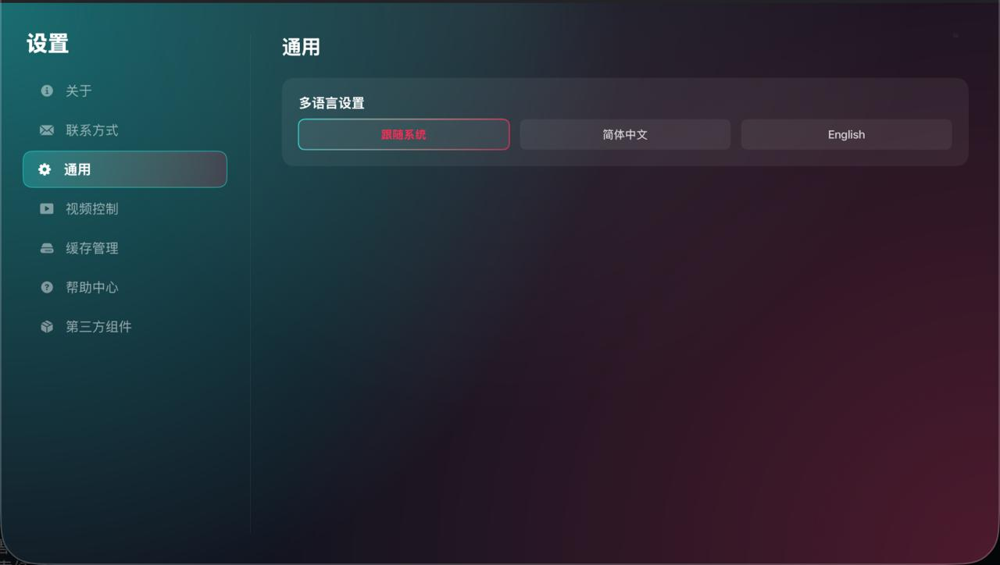
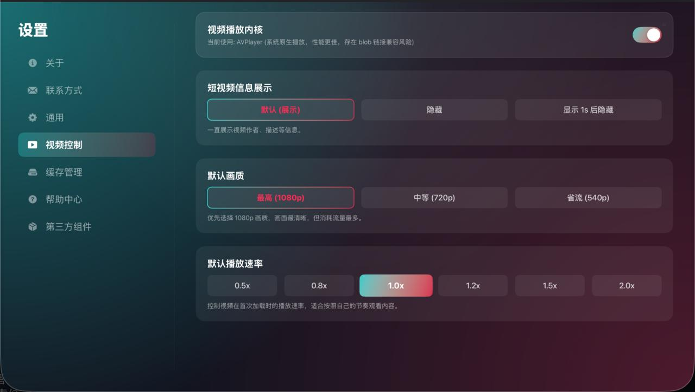

  
  <h1>THLDYTV · 热门短视频 TV 版</h1>
  
<strong>📺 重塑大屏内容生态，专为 Apple TV (tvOS) 打造的沉浸式影音终端</strong>

  
  

    
    
    
  

  

    
  

> **📢 注意：** 本项目目前为闭源状态，主要用作技术展示与内测体验。点击上方 TestFlight 即可获取大屏刷短视频的最佳解决方案。

---

## 🎬 零界限的动态视觉 (Demo)

告别漫长的加载圈。我们重构了底层拉流逻辑，在您按下遥控器的瞬间，下一个视频已经准备就绪。

  <video src="screenshot/切换视频.mp4" width="85%" controls preload="metadata"></video>
  
<em>丝滑的遥控器上下滑动切换体验，零延迟预缓冲，指尖轻触，世界即达。</em>

---

## ✨ 重新定义 TV 交互 (Features)

🚀 **原生 TV 交互与沉浸体验**
* **焦点引擎深度契合 (Focus Engine)**: 抛弃粗糙的移植逻辑，纯血 tvOS 开发。遥控器操作指哪打哪，每一帧焦点转移都符合直觉。
* **Siri Remote 无缝映射**: 轻触或按压遥控器上下方向键，丝滑切换视频；左右轻扫即可精准调节播放进度。
* **自适应画幅与毛玻璃艺术**: 针对横屏电视与竖屏视频的天然冲突，我们独创了动态“毛玻璃”背景系统，实时提取视频主色调并向两侧晕染，让竖屏内容在大屏上再无突兀的黑边。

⚡️ **极速秒开与双核驱动**
* **智能预缓冲矩阵**: 在后台无感加载后续序列的视频流与元数据，把等待时间压缩到 0 毫秒。
* **极光开场视效**: 启动 App 瞬间即刻渲染首帧视频，搭配优雅的极光渐变过渡，为您呈现真正的“所见即所得”。
* **双核播放器无缝切换**: 面对复杂的视频防盗链和网络抖动，应用内置双播放器内核。当一个内核拉流受阻，另一个将在后台热切换，确保画面永不中断。

💾 **聪明的空间管家**
* **精细化容量控制**: 电视存储寸土寸金。我们为您提供了 500MB、1GB、2GB 或无限制等多档缓存上限策略。
* **静默垃圾回收**: 触及缓存阈值后，系统将自动唤醒后台清理机制，像扫地机器人一样默默淘汰最旧的视频碎片。

---

## 📸 全景图赏与功能矩阵 (Gallery)

我们在设计时坚信：**电视不该只是放大的手机。** 以下是我们在大屏幕上打造的核心场景展示。

### 01 / 沉浸视听与精准控制

  
  
<b>沉浸式播放</b>：剔除所有干扰元素的极简播放界面，让内容本身成为客厅的焦点。

  
  
  
<b>呼之即来的控制中心</b>：轻触即可唤出半透明的视频控制层，从点赞、收藏到画质切换与选集，全屏操控尽在掌握。

### 02 / 社交互动与全局探索

  
  
  
<b>大屏社交与搜索</b>：为大屏重新排版的评论区，清晰的盖楼回复；以及支持历史记录和热点追踪的高效搜索引擎。

### 03 / 你的内容宇宙

  
  
  
<b>博主作品集与关注动态</b>：不仅是刷推荐，你还能进入博主的专属主页进行深度考古，或在“我的关注”里跟进最新动态。

### 04 / 跨设备桥梁与深度定制

  
  
<b>云端无缝对接</b>：手机扫码即刻登录，云端同步你的推荐算法模型、收藏库与偏好数据。

  
  
  
<b>硬核设置面板</b>：支持调节极光主题、自动连播逻辑、默认画质偏好，乃至底层的播放器解码内核。

### 05 / 跨时空的狂欢

  
  
<b>直播与弹幕引擎</b>：不只短视频，我们还带来了完美的直播间体验。自定义弹幕的透明度与速度，让客厅秒变跨时空的互动现场。

---

## 🔧 进阶操作指南

* **推荐算法激活**：初次安装时，强烈建议呼出左侧菜单进入“我的”进行 **扫码登录**。这将唤醒您的专属推荐模型，并成倍提高视频的拉流成功率。
* **唤醒主控台**：在任意非播放极简模式下，向左轻扫或按返回键，即可滑出左侧功能侧边栏。在这里您可以随时刷新当前列表或深层清理缓存。

---

## 📝 声明 (Disclaimer)

本项目仅作为 iOS/tvOS 平台技术交流、UI/UX 设计分析及个人兴趣之作。应用内所涉及的所有数据与视频内容均来自互联网公开接口及原始链接，本项目 **不存储、不提供、也不传播** 任何侵权的第三方内容。如给您带来任何困扰，请随时与开发者取得联系。
