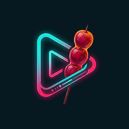
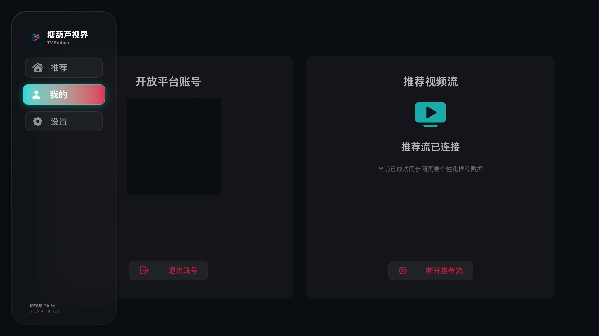
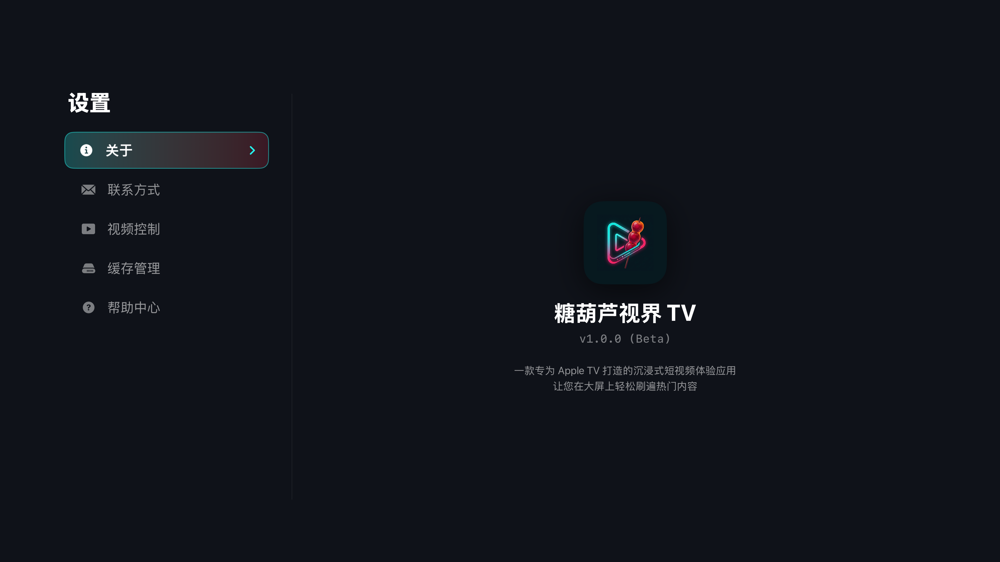

  
  <h1>THLDYTV (抖音 TV 版第三方客户端)</h1>
  
专为 Apple TV (tvOS) 打造，提供沉浸式的大屏刷视频体验。

  
  

 

> **📢 注意：** 本项目目前为闭源状态。您可以直接点击上方 TestFlight 链接参与内部测试体验。

---

## 🎬 界面动态演示 (Demo)

---

## ✨ 核心功能 (Features)

- **原生 TV 交互体验**
  - 完全适配 Apple TV 焦点引擎 (Focus Engine)。
  - 支持 Siri Remote 丝滑滑动，一键上下切换视频。
  - 沉浸式全屏播放，自动适应横屏电视比例，结合绝美的“毛玻璃”背景效果完美呈现竖屏视频。

- **极致“秒开”与丝滑播放**
  - 智能后台无感预缓冲，提前加载接下来的视频流。
  - 打开 App 的瞬间直接展示视频，配合优雅的极光渐变动画，打造真正的“零等待”开屏体验。
  - 支持双播放器内核实时无缝切换，彻底告别视频防盗链和黑屏卡顿。

- **自定义缓存与空间管理**
  - 在大屏电视上也能随心所欲管理存储空间。
  - 用户可在设置中自定义本地缓存上限（500MB, 1GB, 2GB, 不清理）。
  - 超过阈值后，系统将自动在后台静默清理最旧的视频，保护电视存储空间不受侵占。

- **极光美学系统**
  - “极光蓝”与“抖音红”融合的流光溢彩主题。
  - 丰富的高级微动效：呼吸光球、丝滑背景过渡和半透明浮层，告别枯燥的加载等待。

- **便捷扫码同步**
  - 支持手机扫码登录，一键同步您的账号推荐算法，在电视上也能刷到懂您的内容。

---

## 📸 应用截图 (Screenshots)

### 播放页面 (视频沉浸式刷刷刷)

### 我的页面 (个人主页)

### 设置页面 (缓存与内核配置)

---

## 🔧 常见操作说明

- **扫码登录**：初次安装无缓存时，建议通过左侧导航进入“我的”面板或首页扫码登录（同步您的账号推荐算法，可极大提高拉流成功率）。
- **切换视频**：在主播放页，轻触并按压遥控器 **上 / 下** 方向键即可丝滑切换上一个 / 下一个视频。
- **后台控制**：呼出左侧导航栏，可随时刷新推荐列表、清理磁盘缓存、变更首选的播放内核。

## 📝 声明 (Disclaimer)

本项目仅供学习、UI 设计分析与 tvOS 平台交流使用。应用内所有数据及视频内容均来自原始公开链接，本项目不存储任何第三方侵权内容。
